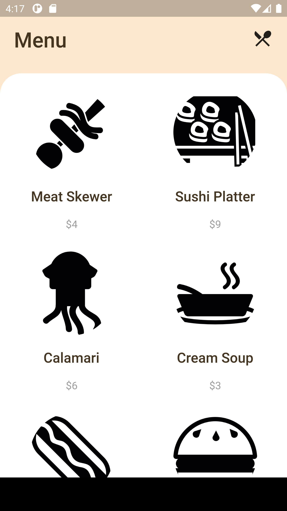
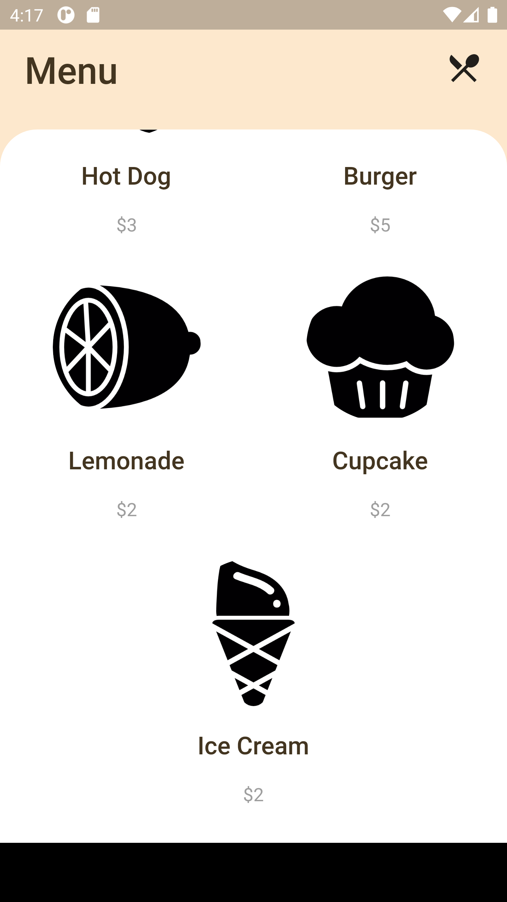

# restomenu

A Restaurant Menu UI using Flutter.

Screenshots below ran on the Nexus 6 virtual device, not yet tested on an iOS device.

Icons made by <a href="https://www.freepik.com" title="Freepik">Freepik</a> from <a href="https://www.flaticon.com/" title="Flaticon">www.flaticon.com</a>

<h2>Screenshots</h2>

 

